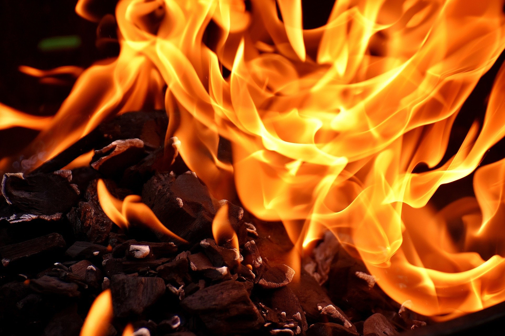

# 불 붙은 식용유에 물을 끼얹으면 안되는 이유

주방에서 튀김 등의 요리를 할 때 너무 오랫동안 가열하면 기름에 불이 붙어 위험한 상황이 생깁니다. 이때, 급한 마음에 불을 끄겠다고 물을 끼얹으면, 불꽃이 매우 커지면서 대단히 위험한 상황을 맞게 됩니다.

요리에 사용하는 식용유에 불이 붙는 온도는 288℃~385℃, 물이 끓는 점은 100℃입니다.

이때 불이 붙은 식용유에 물이 닿으면, 순간 기화되면서 체적이 1680배가 되어 불이 붙은 기름이 폭발하듯 비산하면서 불꽃이 매우 커집니다.

기름과 물은 서로 밀어내고, 물은 기름보다 무거우므로, 기름 밑에 물이 가라앉습니다. 불이 붙은 기름은 물을 기화시킬 온도가 충분하므로, 물이 그대로 기화되면서 화산이 폭발하듯 폭발하는 것입니다.

이것을 보일오버(Boil over) 현상이라고도 하는데, 화재가 발생한 유조차에 물을 소화제로 사용하면, 마찬가지로 불꽃이 비산하고 뜨거운 기름을 사방으로 날리면서 대형 사고가 납니다.

식용유 화재의 소화 방법은 산소를 차단하는 질식 소화나, 발화점을 낮추는 냉각 소화가 유효하며, 가정에서는 급한 대로 **배춧잎, 마요네즈, 소금, 베이킹소다** 등을 사용합니다.

화재는, 요리를 하면서 자주 발생하기 때문에 화원이 가까운 곳에 **K등급 소화기**를 비치해 두는 게 좋습니다.
