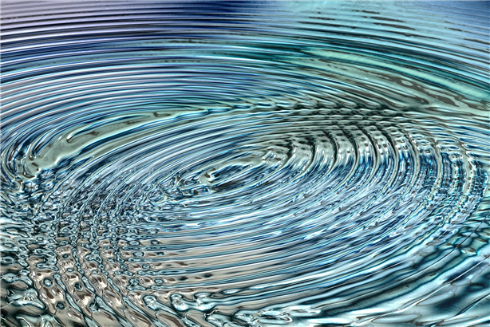
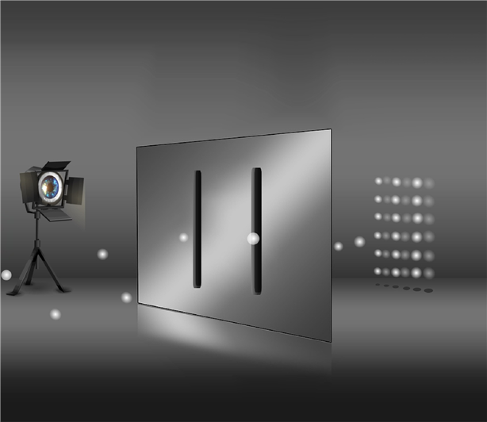

# 물질은 파동과 입자의 상태이다(양자역학)

모든 물질은 원자로 이루어져 있다.

원자는 물질을 이루는 최소 단위이며, 분자는 물질의 성질을 나타내게 되는 입자의 최소 단위이다. 예를 들면, 물 분자(H2O)는 수소 원자(H) 2개와 산소 원자(O) 1개로 이루어진다. 이 중 하나가 더 많거나 적거나 하면 물의 성질은 가질 수 없다.

마찬가지로 산소 분자(O2)는 산소 원자 2개로 이루어져 있으며, 산소 원자 1개로는 우리가 호흡에 사용되는 산소의 성질을 갖을 수 없다.

이렇듯 물질의 최소 단위는 원자이며, 원자는 원자핵과 전자로 구성되어 있고, 원자핵은 다시 중성자와 양성자로 구성된다.

빛은 전자기파에 속한다. 즉, 파동(에너지)이다.

아이작 뉴턴은 빛이 입자로 이루어져 있다고 주장하였으나, 그 후 토마스 영의 이중 슬릿 실험에 의해 빛이 파동임을 보여 주었고, 제임스 맥스웰이 빛은 전자기파임을 밝혀낸다.

하지만 놀랍게도 이 빛도 물질과의 상호 작용에서는 입자처럼 행동한다. 빛이 입자로 나타날 때는 광자라는 입자로 나타나기 때문에 뉴턴의 주장도 완전히 틀린 말은 아니었다.

토마스 영의 이중 슬릿 실험은 빛의 파동성을 증명하는 실험이다. 빛을 이중 슬릿에 통과 시키면 그것이 파동이냐 입자이냐에 따라 결과가 달라진다.

파동은 회절과 간섭의 성질을 가지고 있다. 따라서 파동이 이중 슬릿을 빠져나오게 되면 회절과 간섭이 작용하고 반대쪽 스크린에 간섭무늬가 나타난다. 반면 입자는 회절과 간섭이라는 파동의 특성이 없으므로 이중 슬롯 모양 그대로 두 개의 선모양 무늬가 나타난다.

그러면 빛을 제외한 전자를 이중 슬릿에 통과시키면 어떻게 될까?

첫 번째 실험에서 전자를 대량 발사해 무늬가 어떻게 나타나는지에 대한 실험을 했다. 이 경우 파동과 같은 무늬가 나타났다. 이에 전자는 입자이지만 상호 작용에 의해 파동과 같은 무늬가 나타난다는 가설을 세운다.

두 번째 실험에서 전자를 한 개씩만 발사해서 어떤 무늬가 나타나는지 실험을 한다. 즉, 전자를 한 개씩 발사하여 전자간 상호 작용을 막기 위해 시간차를 두는 것이다. 하지만 이 역시 파동과 같은 무늬가 나왔던 것이다.

이상한 일이 발생한 것이다. 첫 번째 실험에서 전자를 대량 발사해 파동의 간섭무늬가 나타났다면, 두 번째 실험에서 전자를 하나씩만 발사했음에도 불구하고 파동과 같은 간섭무늬가 나타나는 이유는 무엇이냐는 것이다.

전자가 이중 슬릿 앞에서 갑자기 둘로 나누어져 이중 슬릿을 통과되기라도 한단 말인가? 하지만 전자는 기본 입자여서 더 이상 나누어지지 않는다.

이게 대체 무슨 일일까?

세 번째 실험에서 실제로 전자가 두 개로 나누어지는지를 확인하기 위해서 이중 슬릿 앞에 관측 장치를 설치했다. 그리고 전자를 하나씩 발사해 보았는데, 이번에는 마치 이를 알고 있었다는 듯이, 전자가 한 개씩 이중 슬릿을 통과하여 결과적으로 두 개의 선 무늬만 나타나는 것이었다. 참으로 기가 막힌 일이었다.

여기서 양자역학에서 중요한 ‘관측’이라는 개념이 등장한다.

즉, 이 실험으로 전자는 관측되기 전에는 파동과 입자의 상태로 중첩되어 있다가 관측하는 순간 입자의 상태로 나타난다는 결론에 도달한다. 이것이 양자역학에서 자주 나오는 ‘양자중첩’ 상태이다.

눈에 보이는 거시적인 세계에서 일어나지 않는 일이, 눈에 보이지 않는 미시적인 세계에서는 상식처럼 이루어 진다. 이것은 과학적인 해석은 아니라고 생각하지만, 질량이 너무나 적디적다 보니, 물질과 에너지의 개념이 모호해지는 것도 같다.

‘물질과 에너지는 본래 하나, E=mc2’

아인슈타인의 유명한 방정식으로 에너지(E)는, 질량(m) 곱하기 광속(c)의 제곱이라는 뜻이다. 즉, 질량이 광속의 제곱을 가지면 에너지로 변환된다는 말이다.

핵분열은 핵에 존재하는 중성자가 다른 핵을 때리면 핵이 두 개가 되면서 일부 질량이 사라진다. 이 질량은 에너지로 변화되면서 강력한 열과 빛을 만들어 낸다. 핵융합은 이와 정반대로 두 개의 핵이 하나의 핵이 되면서 일부 질량이 사라지며, 사라진 질량이 에너지로 변환된다.

이와 같이 에너지와 물질은 본래 하나이다.

즉, 색불이공(色不異空) 공불이색(空不異色) 색즉시공(色卽是空) 공즉시색(空卽是色) 또는 색심불이(色心不二)하다. 여기서 ‘색(色)’은 물질이고 ‘공(空)’과 ‘마음(心)’은 에너지를 말한다.

더욱 깊이 들어가서 양자 이전의 끈 이론 상태까지 내려가면 이미 증명을 할 수도 없고, 수학적으로만 이해할 수 있는 세계이다. 다만 끈 이론에 의하면 아무것도 없는 상태에서 양자가 홀연히 나타나는 양자요동의 상태를 설명할 수 있다.

그리고 끈 이론에서 말하는 모든 난제 들을 설명할 수 있는 날이 온다면, 생명에너지의 모습도 증명해 볼 수 있다고 생각해 본다.

이것으로 볼 때, 물질과 에너지의 상태는 생명에너지가 고정화 되면 물질이 되는 것이고, 물질이 에너지가 되기도 하다가, 물질이 흩어지면 다시 생명에너지로 돌아가는 순환을 한다고 볼 수 있다는 것이다.
