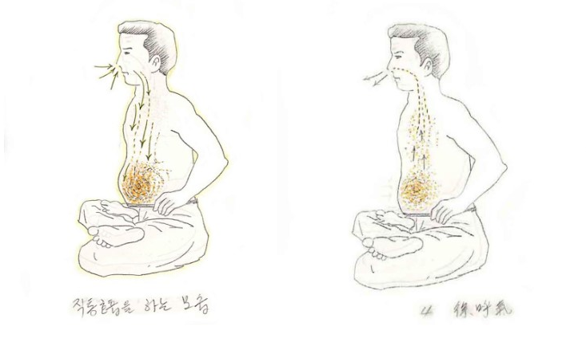

# 기본 호흡법

단전호흡(丹田呼吸)은 숨을 들이마실 때는 아랫배(하단전)를 부풀리며, 숨을 내쉴 때는 아랫배를 등 쪽으로 당겨주며 내쉬는 방식의 호흡을 말한다.

즉, 호흡하는 모습만 볼 때는 복식호흡과 똑같다. 다만, 단전호흡이 복식호흡과 다른 점은 생명에너지의 존재를 인식하고 그것을 유도해서 축적하는 방법이 추가된다는 것이 다를 뿐이다.

사람이 태어났을 때 처음에는 복식호흡만 하다가 점차 성장할수록, 긴장과 스트레스를 경험하면서 호흡이 조금씩 폐 상부로 이동하며 폐첨 호흡이 된다. 이렇게 되면 폐 깊숙한 곳까지 충분히 산소가 도달하지 못하게 되며, 건강에 좋지 못한 영향을 미치게 된다. 산소와 이산화탄소의 교환을 하는 폐포는 패의 하부에 더 많이 존재한다.

이것을 볼 때, 건강한 삶을 살기 위해서라도 단전호흡은 필수적인 것이 된다는 뜻이다.

아무튼, 오래도록 폐 상단부만 이용하는 폐첨 호흡에 익숙한 일반인은 처음에는 단전호흡이 어색할 것이다.

이때, 풍선을 연상하면 단전호흡을 하기 쉽다.

풍선은 바람이 들어가면 부풀고, 바람이 빠지면 줄어든다. 이 풍선이 자신의 아랫배에 있다고 생각하고 호흡을 하면 한결 쉬어진다.

숨을 들이마실 때는 우주에 널려 있는 생명에너지를 찬찬히 음미하듯 들이마셔야 한다. 감기에 걸려 코가 막히지 않은 한, 반드시 코로 숨을 쉬어야 하며, 되도록 코에서는 소리가 나지 않도록 마시는 것이 좋은 방법이다.

코에는 여러 기능이 마련되어 있다. 들이마신 숨을 촉촉하게 가습하는 부분, 외부의 찬 공기를 따뜻하게 하는 부분이 있으며, 바로 위쪽에는 상단전이 있어 이곳에서 방금 들이마신 생명에너지와 서로 상호 작용하며 정교한 전처리를 거친다. 참고로 코는 해부학적으로도 전두동, 곧 이마와 연결되어 있다.

이때 기계적으로 코로 공기를 들이마신다고 생각하지 말고, 우주에 충만한 생명에너지를 코로 들이마셔 생명에너지가 기도를 타고 그대로 내려와 자신의 하단전이 부풀어 오름과 동시에 하단전 부위에 차오른다고 생각한다.

물론 이때 폐에는 물질인 공기가 남아 있지만, 생명에너지는 하단전으로 그대로 내려와 자신의 선천적으로 지닌 생명에너지와 방금 호흡으로 들이마셔 유입된 생명에너지가 하단전에서 서로 만나 충돌하면서 단(丹)이 형성된다.

숨을 다 들이마셨다면 ‘호식(呼息)’에 들어간다. 호흡을 천천히 내뿜는다. 숨을 내뿜으면서 서서히 아랫배는 등 쪽으로 당겨주어야 한다. 이것을 반복한다.

필자가 호흡법을 배울 당시 이것을 '직통호흡'이라고 불렀다.

보통 3~4초 호흡을 들이마셨다면, 다시 3~4초 간격으로 내쉰다. 즉, 들이마시는 숨,  내쉬는 숨, 즉 흡식(吸息), 호식(呼息)의 비율은 '1:1'이다.

답답하다고 느껴질 때는 초수를 좀 더 낮추거나, 그마저도 어렵다면 그냥 숨을 들이쉬면 아랫배, 즉 하단전이 나오고, 내쉴 때 아랫배가 들어가면 된다. 그리고 가끔 일반호흡으로 돌아가 쉬어가며 연습을 하면 된다.

너무 완벽하게 하려 애쓸 필요는 없다. 본래의 자연스러운 호흡으로 돌아가려는 마음으로 연습하다 보면, 어느 순간 호흡의 감각이 저절로 잡히게 된다.
