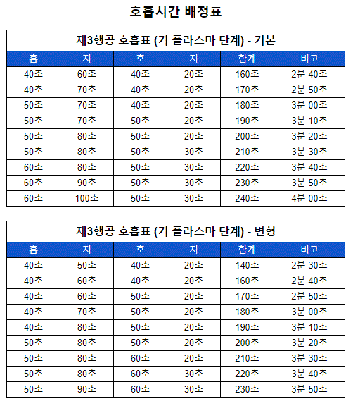

# 제 3차 행공 (기(氣) 플라즈마 단계)

제1차 행공(기(氣) 축적 단계)과 제2차 행공(기(氣) 강화 단계)를 무사히 마친 사람은 이제부터 생명에너지를 보다 차원 높은 수준으로 끌어올리는 제3차 행공(기(氣) 플라즈마 단계) 수련에 임해야 한다.

이 글을 처음 대하는 수련자라면 당연히 1차 행공부터 시작하여 차츰 그 단계를 높여 나가야 할 것이다. 보통 1차 행공의 기간은 1개월에서 2개월 정도 소요된다. 그리고 1차 행공을 바탕으로 &lt;수련 전 경고사항 및 주의사항&gt;을 참고하는 것이 좋을 것이다. 2차 행공의 기간은 1차 행공을 마치고 역시 1개월에서 2개월 정도 소요된다.

하지만 행공의 단계를 올리는 것은 호흡량으로 판단해야 하는 것이지, 기간은 참고로 생각해야 한다.

호흡량을 늘려 나갈 때는 생명에너지의 충만함을 느끼고 호흡의 여유가 생길 때 한 단계씩 밟고 올라가야 한다. 단순히 물리적인 호흡량을 올린다고 생명에너지가 축적되는 것은 아니며, 생명에너지의 본질을 이해하고, 느껴나가는 것이 중요하다.

그러므로 3차 행공부터는 기의 플라즈마 현상을 접할 수 있도록, 소주천, 전신주천 등 각종 경략유통 과정을 병행하고 심도 있게 접근해야한다.

아래에 제시된 호흡량 배정표는 자신의 호흡에 맞춰 적절히 응용해 나가면서 시도해 보되, 절대로 무리하게 접근하지 말아야 한다.

3차 행공부터는 생명에너지의 축적 단계가 고밀도로 이루어진다. 특징적으로 전신에 생명에너지가 고밀도·고열량으로 축적되면서, 고온의 플라즈마 상태로 승화되어 가는 것이다. 플라즈마 상태는 절연의 상태를 넘어서는 것으로, 내부의 축적된 생명에너지가 피부라는 장벽을 넘어 기공(氣孔)을 통해 외부(우주)의 생명에너지와 본격적으로 교류를 시작하는 상태이다.

그리고 1차 행공이나 2차 행공에서도 나타날 수 있지만, 3차 행공 이상을 수련하다 보면 체내에 높은 열량의 생명에너지가 축적되면서 입안이 뜨거우면서 마를 때가 있다. 하단전에서 융합한 생명에너지가 니환궁으로 올라오면서 입 쪽을 거치기 때문인데, 이것이 수월하게 올라가지 못하면서 일종의 저항열이 생기는 것이다.

해결 방법은 의외로 간단한데, 입천정에서 앞니가 자라나는 뿌리 부분의 오목한 곳 부근, 그러니까 경혈상으로 수구혈(인중)의 반대편인 곳이다. 이곳에 혀끝을 갖다 대면 서늘한 느낌이 드는데, 혀끝으로 선뜻선뜻 서늘한 느낌을 즐기다 보면 어느새 버틸 만해지면서 입안의 열기가 사라지는 것을 알 수 있을 것이다. 그러니까 혀를 입천정에 잘 붙이라는 이유는 이 때문이기도 한 것이다.

제3행공이 끝나고 고차행공에 들어가면, 목표 지점에 가까이 왔음을 직감할 것이다.

그리고 다 똑같을 순 없지만, 수련자에 따라서 그야말로 생사일여(生死一如)의 경계에 서서 사선을 넘나드는 극한의 고통을 맛보아야 할지도 모른다. 실제로 자신이 죽었는지 살았는지 확인해 보는 지경에 처한다. 하지만 1차 행공부터 시작해서 이곳까지 생명에너지를 충분히 축적하여 도착했다면 크게 걱정할 필요는 없다.

하지만 초심자는 이러한 방법에 호기심을 갖거나 시도해서는 안 된다. 반드시 1차 행공과 2차 행공을 거친 후 시도해야 한다. 위의 경고를 무시하고 계속해서 진행시켜 나간다면 생명에 위협이 될 수 있음을 알아야 한다.

물론 하고 싶어도 할 수 없는 단계이기도 하다. 하지만 절대로 흉내 내어서는 안 된다. 자칫하면 생명을 잃을 수도 있기 때문이다. 생명은 귀중한 것이다. 생명을 잃고 나서 얻을 수 있는 것은 아무것도 없다. 초심자는 명심해야 한다.

생명에너지가 체내에 충분하게 축적된 상태에서 호흡에 여유가 생길 때 단계를 밟아 나가는 것은 큰 무리가 없다. 하지만 처음부터 욕심을 내서 수련하면 분명 생명에 지장이 있을 수 있음을 알아야 한다. 이렇게 강하게 경고를 함에도 불구하고 이를 무시하고 실행하는 수련자는 생명을 보장받을 수 없음을 알아야 한다.

3차 행공부터는 호흡량이 호흡표대로 올라가지 않고 몇 단계를 훌쩍 뛰어넘기도 한다. 앞서 말했듯, 기공이 본격적으로 열리기 때문인데 정상적인 반응이니 걱정 말고 수련에 임하기 바란다. 간혹 30분 이상의 지식(止息)을 하는 등 호흡의 한계를 넘는 수련자가 나오기도 한다.

💾 [제 3차행공 호흡량 배정표.txt](../../_Other/hoheup-ryang-baejeong3.txt)
