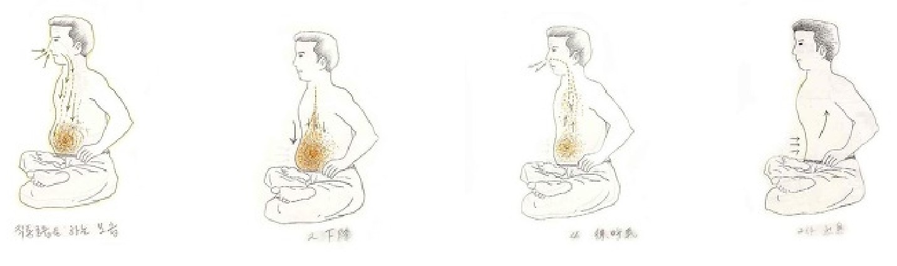

# 직통호흡으로 전환

2단계호흡을 오래수련하다 보면 어깨와 목에 무리를 느끼는 경우가 있다.

이럴때 직통호흡으로 전환하면 상당부분 이러한 문제를 해소할 수 있다. 물론 호흡법을 바꾸게 되면 처음에는 어색하겠지만 조금 수련하다보면 금세 적응이 되기 때문에 이러한 부분에 있어서 너무 걱정하지 않아도 좋다.

이를 통해 그동안 2단계호흡을 하면서 그동안 잘못하고 있었던 부분을 발견할 수도 있고, 나중에 컨디션이 좋아지면 다시 2단계호흡으로 전환하면 그만이기 때문에, 2단계호흡을 하면서 무리를 느끼는 수련자라면 있다면 고민하지 말고 직통호흡법을 시도해 보는 것도 좋을 것이다.

직통호흡의 장점이라면, 우선 신체의 무리를 덜 주면서 생명에너지를 축적할수 있고 생활행공과도 자연스럽게 연결되면서 2단계호흡을 통해 생활행공을 하는 것에 비해서 수월함을 경험할 수 있다. 그리고 와공(臥功)시 2단계호흡에 비해 훨씬 편안하다는 장점이 있다.

2단계호흡이 생활행공을 하지 못하는 것은 아니지만 아무래서 옆에서 보면 직통호흡에 비해 자연스럽지 못하다는 단점이 발견될 것이다. 반면 직통호흡의 경우는 자세히 보지 않는 다면 겉에서 보면 티가 나지 않아서 타인의 시선이 불편한 수련자라면 생활행공을 함에 있어서 커다란 장점으로 다가올 것이다.

물론 2단계호흡으로 규칙행공을 하면서 생활행공은 직통호흡으로 해도 되기 때문에 구태여 장점을 들자면 그렇다는 것이니 너무 심각하게 받아드릴 필요는 없다고 본다.

단점이라면 2단계호흡에 비해서 강렬한 느낌은 다소 약하게 느껴진다는 것이다. 그리고 호흡량을 늘려감에 있어 아무래도 직통호흡은 2단계호흡에 비해 다소 불리한 점이 있다. 그에 비해 부드러운 기감은 2단계호흡에 비해 뛰어나기 때문에 2단계호홉과 직통호흡의 장단점을 잘살려 자신에게 필요한 부분을 활용하면 되는 것이다.

규칙행공을 성실히 하는 수련자라면 자동으로 생활행공이 이루어 진다. 이 때 2단계호흡으로 규칙행공을 하면 주로 지식(止息)호흡 위주의 강렬한 축적반응이 느껴진다면, 직통호흡의 경우 조식(調息) 위주의 우주의 생명에너지와 끊임없는 연결을 이루는 부드러운 반응이 나타난다는 점이다.

대략적인 것은 2단계호흡과 동일하므로 호흡방법만 설명하기로 한다.

직통 호흡은 ‘단전호흡(丹田呼吸) 기초’에서 설명했던 것처럼 숨을 들이마실 때는 아랫배(하단전) 나오며, 숨을 내쉴때는 아랫배를 등쪽으로 당겨주는 방법인 것이다.

숨을 들이마실 때는 우주에 널려있는 생명에너지를 찬찬히 음미하듯 들이마셔야 한다. 반드시 코로 숨을 쉬어야하며, 되도록 코에서는 소리가 나지 않도록 마시는 것이 좋은 방법이다.

코에는 여러 가지 장치가 되어있다. 들이마신 숨을 가습하는 부분, 외부의 찬공기를 따뜻하게 하는부분, 또한 코 바로 위에는 상단전이 있어 이곳에서 생명에너지를 정묘하게 변화 시키는 작용도 한다.

이때 기계적으로 코로 공기를 들이마신다고 생각하지말고, 우주에 충만한 생명에너지를 코로 들이마셔 생명에너지가 기도를 타고 그대로 내려와 자신의 하단전이 부풀어 오름과 동시에 하단전 부위에 차오른다고 생각한다. 물론 폐에는 공기가 그대로 남아 있지만 끊어지는 느낌을 만들 필요는 없기 때문이다. 이 때, 호흡으로 들이 마시는 생명에너지와 자신이 선천적으로 지니기 있는 생명에너지가 서로 충돌하며 강력하게 융합하여 간다고 생각한다.

숨을 다 들이마셨다면, 그대로 호흡을 정지하면서 하단전에서는 생명에너지가 본격적으로 강렬하게 융합되어 간다고 생각한다. 생명에너지는 호흡을 다 들이마신 시점에서 최고조의 상태에다. 이때 지식을 하면 최상의 상태에서 융합이 이루어 지는 것이다.

지식을 다 마쳤다면 호흡을 천천히 내뿜는다. 숨을 내뿜으면서 서서히 아랫배는 등 쪽으로 당겨주어야 한다.

다 내쉬었다면 보통 이 상태에서 2차지식에 들어간다.
