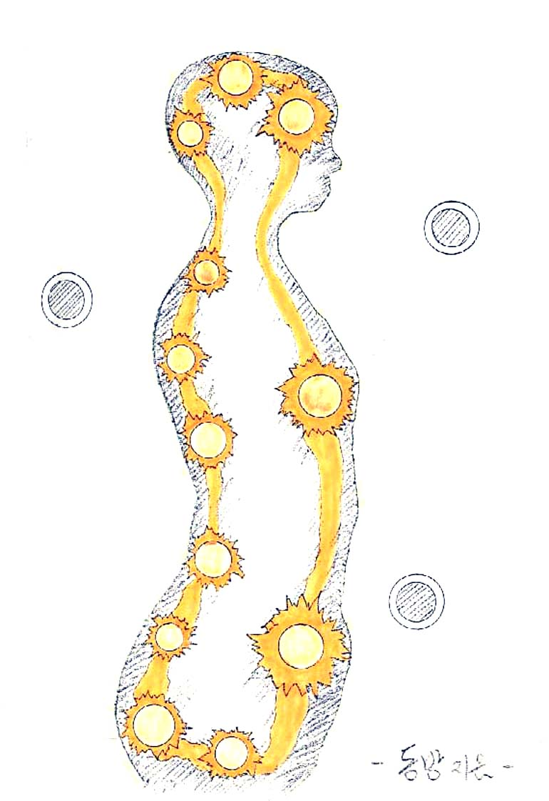

# 기(氣)를 움직여 보자

생명에너지를 축적시키면 생명에너지가 자신의 의지대로 움직인다는 것을 알 수 있다. 호흡을 하면서 느껴지는 생명에너지를 필요한 곳에 공급시키면 된다.

주로 다리 쪽 등 인체의 하단 위주로 움직인 뒤 점차 위로 올라오면 된다. 또는 가슴 부위에 위치시키면서 태양처럼 빛나는 빛의 구체를 상상하며 육체를 조화시킨다고 생각해도 된다.

단전호흡(丹田呼吸)에는 이른바 '소주천(小周天)', '대주천(大周天)' 같은 것들이 있는데, 대개 후에 발견된 '경락(經絡)학'과 만나면서 이것이 '침구학(鍼灸學)'인지 호흡법인지 구분하기 힘들어지게 되었다.

아무튼 소주천이나 모든 기(氣) 운용법은 지식(止息) 시에 기를 유통시켜 주는 것이 기본이다. 하지만 그럴 수 없을 때는 이런 원칙을 떠나 가벼운 마음으로 소주천을 해도 무방하다.

임맥(任脈)은 인체 전면의 정중선에 있고, 독맥(督脈)은 척추를 중심으로 한 후면의 정중선에 있다.

따라서 하단전에서 생명에너지를 하강시켜 항문과 성기 사이의 움푹한 곳인 회음(會陰)으로 나와, 꼬리뼈 부근인 장강(長强)을 거쳐 명문(命門), 중추(中樞), 대추(大椎), 뇌호(腦戶), 백회(百會), 상단전인 인당(印堂), 중단전인 구미(鳩尾), 그리고 하단전인 기해(氣海)에 이르게 하면 일주한 것이 된다.

경혈명이나 위치를 억지로 암기할 필요는 없다.

해당 경혈에 이를 때마다 2~4초가량 정지시켜 준다. 그리고 지식(止息)이 늘어날수록 정지시키는 시간을 늘려 주어도 된다. 또는 물 흐르듯이 멈춤 없이 순환시켜 주어도 된다. 두 가지 방법을 적절히 병행해도 되고, 한 가지만 선택해도 된다. 순환이 거듭될수록 생명에너지의 느낌이 점점 강해질 것이다.

본래 '경락(十二經絡)'은 자율적으로 움직이는 육체의 생명에너지 회로와 같은 것이기 때문에 인간의 후천적인 의지로 조절하는 것이 아니다. 다만 그 부위에 생명에너지를 이끌어 주면, 열차가 석탄을 수송하듯 어느 정도 이용할 가능성이 생길 뿐이다.

그렇다면 몸 전체에 생명에너지를 축적하면 그만이다. 또한 흐르는 물이 맑듯이 가볍게 전신에 생명에너지를 순환시켜 준다면 그것으로 모든 복잡한 문제가 간단하게 해결된다.

소주천을 유심히 살펴보면 수직 방향의 흐름이다. 점차 폭을 넓혀 가다가 나중에는 전신을 수직 방향으로 순환시켜 준다. 또는 하단전에서 머리꼭대기(백회) 근처로 생명에너지를 이동시킨 뒤 샤워하듯 신체를 유통시켜 본다. 발바닥까지 이르면 역순으로 돌아와 본다.

또는 소주천을 하면서 다리 바깥쪽을 따라 발바닥을 거쳐 다시 다리 안쪽으로 순환시키고, 등줄기(독맥)를 따라 올라온 뒤 팔 바깥쪽을 따라 손바닥을 거쳐 다시 팔 안쪽으로 순환시킨 다음, 독맥으로 되돌려 소주천을 마무리한다.

방법은 자유롭다. 한쪽씩 순환시켜도 되고, 양쪽을 동시에 순환시켜도 된다. 순서 또한 자유롭게 바꾸어도 무방하다.

이러면 거의 수직의 흐름만 있는 데, 발끝부터 머리까지 고리 형태로 순환시켜 보거나, 나선의 느낌으로 생명에너지를 감싸서 올려 본다. 또는 반대로 내려오는 방법도 시도해 본다.

